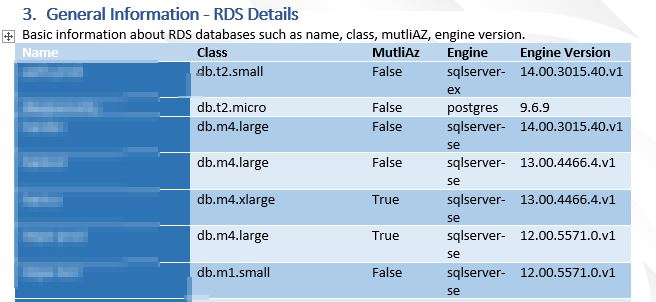
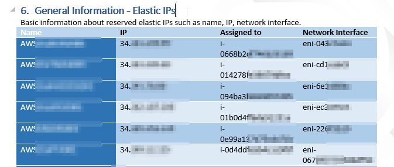
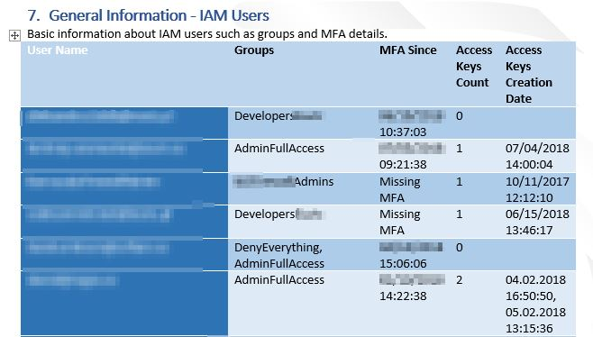

# PSWinDocumentation.AWS - PowerShell Module

`PSWinDocumentation.AWS` is a PowerShell module that has a single goal of getting AWS Information

## Overview

It uses [PowerShell SDK](https://aws.amazon.com/powershell/) to generate list of resources. For now it supports:
- EC2 (Instance details, name, environment, IP etc.)
- RDS (Instance details, environment, name, etc.)
- ELB & ALB (Name, type of LB, scheme, DNS Name, targets)
- Network (Subnet details, CIDRs, VPC)
- Elastic IPs (IP, where is it attached)
- IAM (User details, groups, MFA, access keys)

### Install

```
Install-Module PSWinDocumentation.AWS -Force
```

## How to use

You have to provide:
- AWS Access Key
- AWS Secret Key
- Region to scan

Read-Only policy can be found in `Data/PSWinDocumentation-Policy.json`.

`Please make sure that tagged items as a [tag] must be filled on AWS side. Otherwise these values will be empty.`


```PowerShell
Import-Module AWSPowerShell
Import-Module PSWinDocumentation.AWS.psd1 -Force

$Configuration = [ordered] @{
    AWSAccessKey = ''
    AWSSecretKey = ''
    AWSRegion    = 'eu-west-1'
}

$AWS = Get-WinAWSInformation -AWSAccessKey $Configuration.AWSAccessKey -AWSSecretKey $Configuration.AWSSecretKey -AWSRegion $Configuration.AWSRegion
$AWS
```

## EC2 Details

Returns list of EC2 instance details:
- InstanceID
- InstanceName `[tag]`
- Environment `[tag]`
- InstanceType
- PrivateIpAddress
- PublicIpAddress


## RDS Details
Returns list of RDS instance details:
- InstanceName
- InstanceClass
- MultiAZ
- InstanceEngine
- InstanceEngineVersion
- Storage [GB]
- Environment `[tag]`



## ELB & ALB Details
Returs list of Load Balancer details:
- LBName
- LBType
- Scheme
- DNSName
- RegistredInstances (targets)

## Subnet Details
Returns list of subnets details:
- SubnetID
- SubnetName `[tag]`
- CIDR
- AvailableIp
- VPC


## Elastic IP Details
Returns list of EIPs details:
- Name `[tag]`
- PublicIP
- Instance attached to EIP
- Network interface attached to EIP




## IAM Details
Returns list of IAM Users details:
- UserName
- Groups attached to user
- MFA Details
- Access Key Details

